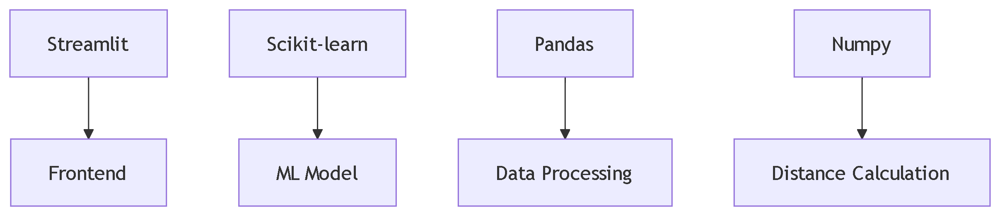

# 🚚 Food Delivery Time Prediction App


<p align="center">
  <a href="#overview">Overview</a> •
  <a href="#features">Features</a> •
  <a href="#installation">Installation</a> •
  <a href="#usage">Usage</a> •
  <a href="#tech-stack">Tech Stack</a> •
  <a href="#license">License</a>
</p>

## 🌟 Overview

A machine learning-powered web app that predicts food delivery time with 85% accuracy using:
- Delivery partner attributes
- Geographic coordinates
- Random Forest regression model

## ✨ Features

| Feature | Description |
|---------|-------------|
| 📍 Precise Distance Calculation | Uses Haversine formula for accurate geospatial distance |
| ⏱️ Real-time Prediction | Instant delivery time estimates |
| 📊 Interactive Dashboard | User-friendly Streamlit interface |
| 🎯 Performance Metrics | Visual indicators for prediction quality |
| 📱 Mobile Responsive | Works across all device types |

## 🛠️ Installation
..bash
# Clone the repository
git clone https://github.com/yourusername/food-delivery-predictor.git
cd food-delivery-predictor

# Create virtual environment (recommended)
python -m venv venv
source venv/bin/activate  # Linux/Mac
venv\Scripts\activate    # Windows

# Install dependencies
pip install -r requirements.txt

## 🚀 Usage
# Run the Streamlit app
streamlit run app.py
Input Parameters:

Delivery Partner:

Age (18-70 years)

Ratings (1.0-5.0 scale)

Location Coordinates:

Restaurant Latitude/Longitude

Delivery Location Latitude/Longitude


## 🖥️ Tech Stack
Core Components
Diagram:

code:
graph TD
    A[Streamlit] --> B[Frontend]
    C[Scikit-learn] --> D[ML Model]
    E[Pandas] --> F[Data Processing]
    G[Numpy] --> H[Distance Calculation]
Dependencies:
    *Python 3.7+
    *streamlit==1.32.2
    *pandas==2.1.4
    *numpy==1.26.2
    *scikit-learn==1.3.2

## 📜 License:
Distributed under the MIT License. See LICENSE for more information.

<div align="center"> <p> <a href="https://github.com/Vasanthkumar5648/food-delivery-predictor/issues">Report Bug</a> • <a href="https://github.com/Vasanthkumar5648/food-delivery-predictor/issues">Request Feature</a> </p> <p>Made with ❤️ by Vasanthakumar</p> </div> ```
